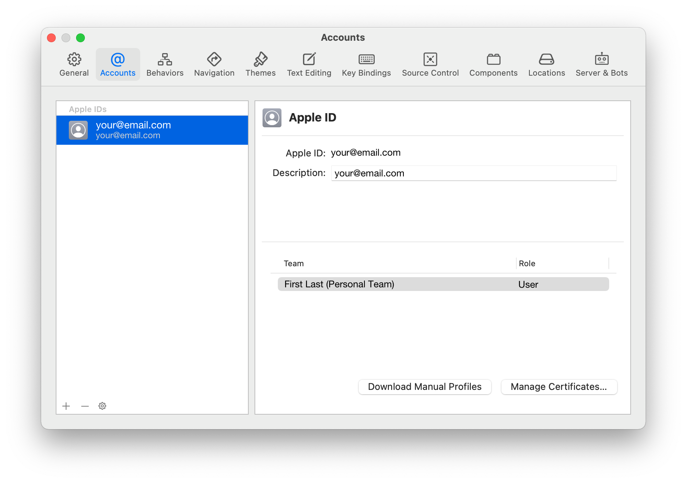

# iOS Environment Setup

In this chapter we are going to create an iOS app that replicates our Kivy UI. In the next chapter we will use this app to control our lamps using Bluetooth Smart (BTLE).  The goal for this chapter is to build the app and deploy it to an iOS device.

Before we start writing iOS apps, however, we need to set up our development environment.

## Create an Apple ID

You can use an existing Apple ID or you can [create a new one](https://appleid.apple.com).

## Install Xcode

You need a Mac running macOS to develop iOS applications. You will also need Xcode. On your mac, open the **App Store** and search for **Xcode** and download.

> **COMPATIBILITY:** the courseware is targeted at the current version of Xcode (12.2) and iOS (14.2).

> Note: if you do not have a Mac, your university has a computer lab with Mac computers and Xcode installed.

### Add Apple ID to Xcode

When Xcode opens, go to **Xcode** > **Preferences** (or press ⌘ + ,). Select the **Accounts** tab and click the add button (**+**) and **Add Apple ID...**.

Sign in with your Apple ID. Your Accounts page should now look something like this:
 

> Note: with [Dark Mode](https://support.apple.com/en-us/HT208976) released in MacOS Mojave, many of the images in this and following chapters may look different from what you will see on your Mac (e.g., white backgrounds versus dark backgrounds).

Next up: [iOS New Project](../08.2_iOS_New_Project/README.md)

&copy; 2015-2021 LeanDog, Inc. and Nick Barendt
