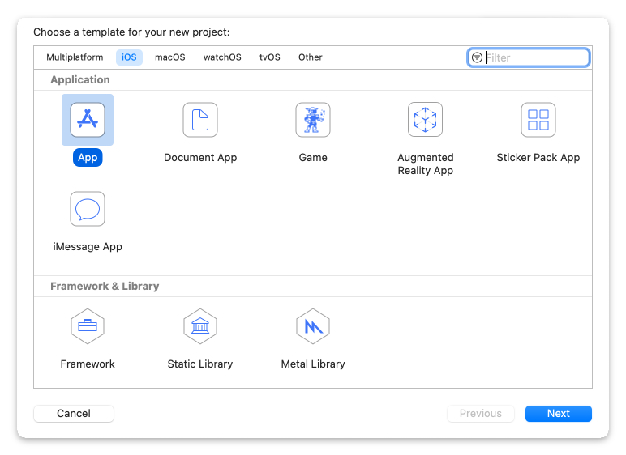
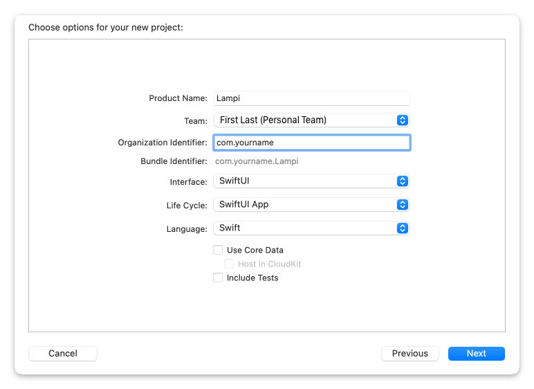
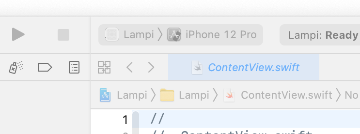
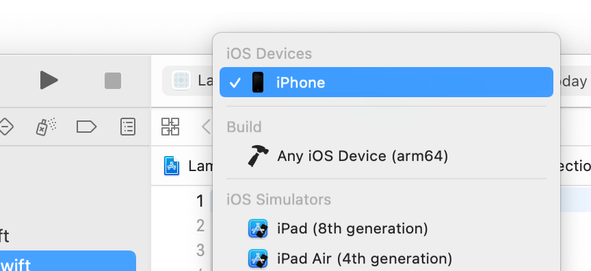
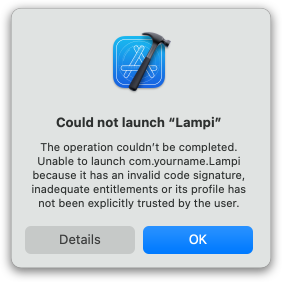

# iOS New Project

Now we are going to build a simple app and deploy it to our iOS device. The assignment will require running on real hardware, so as you run through this make sure you can deploy to a iPhone and not just the iPhone Simulator.

### Start a New Project

From the welcome page of Xcode, click **Create a new Xcode project** (or in the menu, **File** > **New** > **Project...**).

Under **iOS** > **Application**, select **App** and click **Next**.

In the next dialog, set:

* **Project Name** to **Lampi**
* **Team** to your name
* **Organization Identifier** to something like **com.[your_name]**
* **Interface** to **SwiftUI** 
* **Life Cycle** to **SwiftUI App**
* **Language** to **Swift** 
* **deselect Use Core Data**
* **deselect Include Tests** (unless you want to use tests, they are not part of this exercise)

**This Courseware is for Swift and SwiftUI. If you are more familiar with Objective C or the other iOS UI technologies and prefer to use it, that is fine, but you are on your own.**

Click **Next**. You will be asked where you want your project to be created. Choose a directory and click **Create** (deselect "Create Git Repository on my Mac").

### Build and Run

Now is a good time to verify that we can run our project on a real phone - the app does not do anything at this point - it will only get more complicated from here. 

Plug in your iPhone to your Mac and unlock your phone if it is protected with a passcode. Up in the Xcode toolbar you should see your **build target** and **device**:

The current device is an iPhone Simulator. Click on it, and under the **iOS Devices** section, choose the iPhone you just plugged in:

Click the **Build and run** (play) button (or press ⌘ + R).

You may be asked to enabled **Developer Mode** on the Mac. Click **Enable** and enter your OS password.

If this is your first time connecting your phone to Xcode, you may need to wait a while for "Processing Symbol Files".

If you get any prompts about Xcode failing to build and/or run and there is a button that says **Fix Issue** -  clicking this button should allow you proceed.

Finally, the very first build will probably fail with a not-at-all-vague, easy-to-troubleshoot error like this: 

To resolve this, go to your iPhone **Settings** > **General** > **Device Management**. You should see an entry with your Apple ID in there. Tap on it and tap **Trust "[apple_id]"**, then tap **Trust**. 

If you are not on the latest version of iOS, try finding the installed app on your phone, tapping it, and tapping **Trust** when prompted.

Go back to Xcode and click **Build and run** again. It should deploy and launch an app with **just a big white screen with "Hello, world!"** on your phone.

Congratulations! You have successfully built and deployed an app to an iOS device (the app does not do anything, yet, but we will work on that now).

Next up: [Making a SwiftUI App](../08.3_Making_a_SwiftUI_App/README.md)

&copy; 2015-2021 LeanDog, Inc. and Nick Barendt
