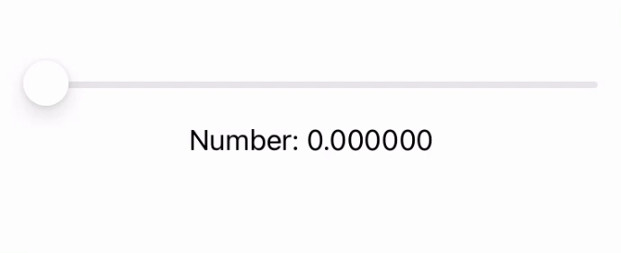

# Reading Characteristics and Notifications

So far, our application only writes to Characteristic values - we need to read them, too.  

## Reading Characteristic Values

When our application starts up, the slider is out of sync with the current value of the Characteristic. Let's do a one-time read of the Characteristic to initialize the slider value.

Reading Characteristic Values in CoreBluetooth is a two-step operation:

1. call `readValue(for characteristic: CBCharacteristic)`
1. implement `peripheral(_:didUpdateValueFor:error:)` to be notified when the value is available

Modify `peripheral(_:didDiscoverCharacteristicsFor:error:)` to initiate a read of our 'Some Number' Characteristic:

```swift
func peripheral(_ peripheral: CBPeripheral, didDiscoverCharacteristicsFor service: CBService, error: Error?) {
    guard let characteristics = service.characteristics else { return }

    for characteristic in characteristics {
        if characteristic.uuid == CBUUID(string: BTLEObject.SOME_NUMBER_UUID) {
            print("Found characteristic with UUID: \(BTLEObject.SOME_NUMBER_UUID)")

            numberCharacteristic = characteristic
            devicePeripheral?.readValue(for: characteristic)
        }
    }
}
```

We are invoking `readValue(for characteristic: CBCharacteristic)` on our Peripheral, passing in the `characteristic` of interest.

Below that, implement `peripheral(_:didUpdateValueFor:error:)` to unpack the unsigned 8-bit value to a floating-point double value and update the stored value:

```swift
func peripheral(_ peripheral: CBPeripheral, didUpdateValueFor characteristic: CBCharacteristic, error: Error?) {
    print("Value updated for characteristic with UUID: \(characteristic.uuid)")
    if characteristic == numberCharacteristic,
       let numberData = numberCharacteristic?.value {

        let newNumber = Double(numberData[0]) / 255.0

        state.number = newNumber
    }
}
```

Run the application - you should see the slider and label updated as soon as the peripheral is connected.

Unfortunately we have one minor problem. If you look at the console logs, you'll see that we triggered the `didSet` observer when we updated the value to the value received from the device. This is because the value isn't 0 and technically it changed.


There are a few ways to prevent this, but the simplest way is to tell the `didSet` observer to skip the next write. Let's add another private flag under `updatePending` to track this:

```swift
    ...
    private var updatePending: Bool = false
    private var skipNextWrite: Bool = false
    ...
```

Update the `didSet` to check this flag (and remove the noisy logging for each update):

```swift
class BTLEObject: NSObject, ObservableObject {
	@Published var state: State = State() {
        didSet {
            if !updatePending && !skipNextWrite && state != oldValue,
               let numberCharacteristic = numberCharacteristic {

                updatePending = true
                DispatchQueue.main.asyncAfter(deadline: .now() + 0.1) { [weak self] in
                    guard let self = self else { return }

                    var intToWrite = UInt8(self.state.number * 255.0)
                    let dataToWrite = Data(bytes: &intToWrite, count: 1)
                    self.devicePeripheral?.writeValue(dataToWrite, for: numberCharacteristic, type: .withResponse)

                    self.updatePending = false

                    print("Updated number characteristic over bluetooth")
                }
            }

            skipNextWrite = false
        }
    }
    ...
}
```

Finally, just before we set our `number` property, set the flag to `true`:

```swift
	func peripheral(_ peripheral: CBPeripheral, didUpdateValueFor characteristic: CBCharacteristic, error: Error?) {
        print("Value updated for characteristic with UUID: \(characteristic.uuid)")
        if characteristic == numberCharacteristic,
           let numberData = numberCharacteristic?.value {

            let newNumber = Double(numberData[0]) / 255.0

            skipNextWrite = true // <-- Set the flag to true
            number = newNumber
        }
    }
```

Run the application again and confirm that you do not see the unnecessary bluetooth write.

**NOTE:** If you are dealing with multiple Characteristics, all of the read values will be reported through this one `peripheral(_:didUpdateValueFor:error:)` callback, so you will likely need a set of conditionals to determine which Characteristic value has been read.

## Enabling Notifications

As we did with `LightBlue` we would like our application to be automatically notified of changes to certain Characteristic values.

We can easily enable BTLE Notifications.  Modify `peripheral(_:didDiscoverCharacteristicsFor:error:)` to add a call to `setNotifyValue` with a value of `true` on the 'Some Number' Characteristic,  like so:

```swift
    func peripheral(_ peripheral: CBPeripheral, didDiscoverCharacteristicsFor service: CBService, error: Error?) {
        guard let characteristics = service.characteristics else { return }

        for characteristic in characteristics {
            if characteristic.uuid == CBUUID(string: BTLEObject.BRIGHTNESS_UUID) {
                print("Found characteristic with UUID: \(BTLEObject.SOME_NUMBER_UUID)")

                numberCharacteristic = characteristic
                devicePeripheral?.readValue(for: characteristic)
                devicePeripheral?.setNotifyValue(true, for: characteristic)
            }
        }
    }
```

Conveniently, notifications of new Characteristic Values are made via the `peripheral(_:didUpdateValueFor:error:)` callback that we already added support to update the `number` property based on the `Some Number` Characteristic value.

Run the application (be sure your `bleno` NodeJS application is running).

With the auto-increment happening on the 'Some Number' Characteristic (due to the `setInterval` in `peripheral.js`), the slider should slowly move left-to-right across the screen, eventually jumping back to 0.0 when the value is incremented past 255 and the modulus operation causes it to be reset to 0. (graphic sped up for effect)



Next up: [09.8 Assignment](../09.8_Assignment/README.md)

&copy; 2015-2021 LeanDog, Inc. and Nick Barendt
