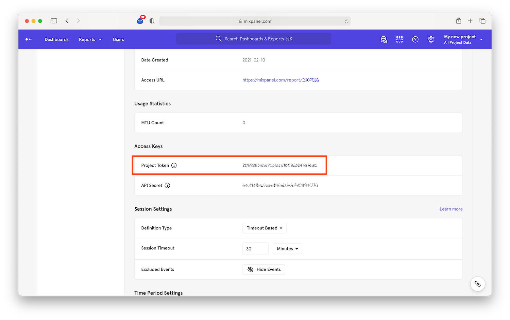
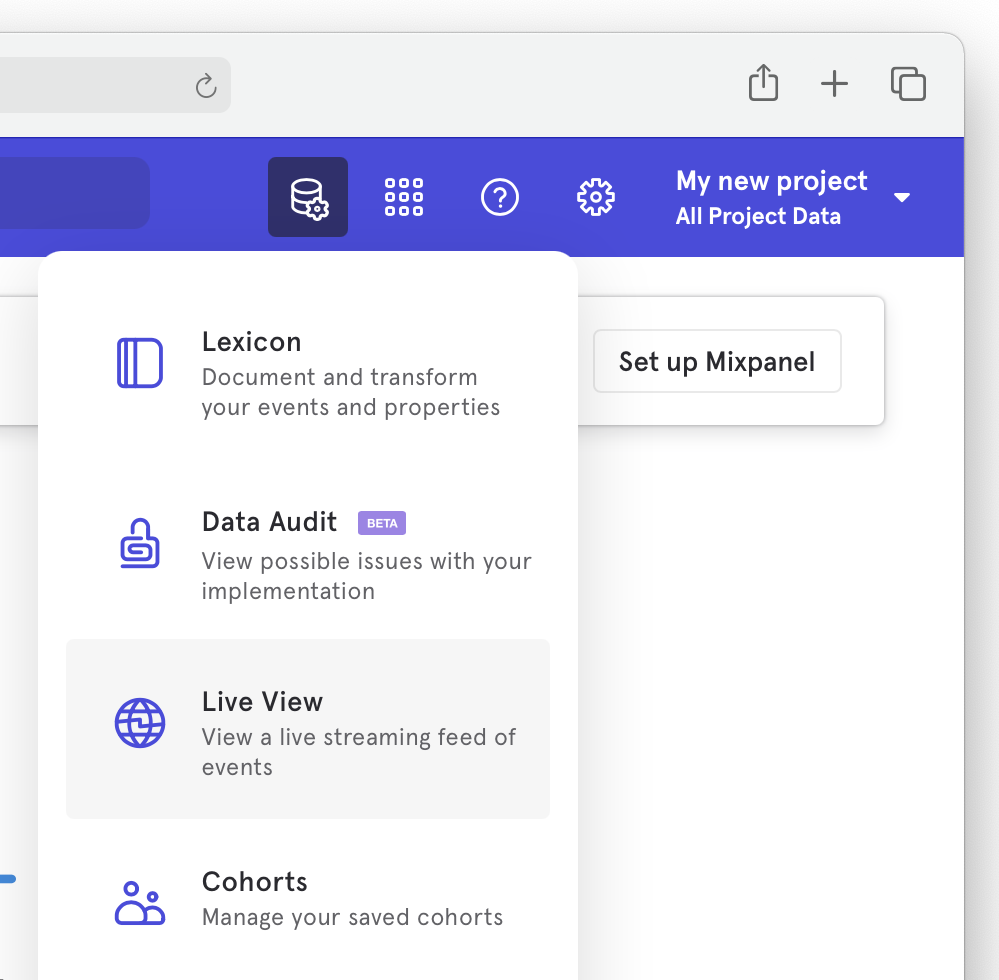
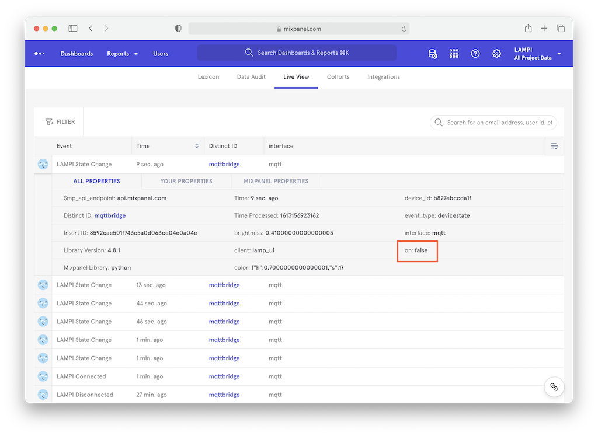
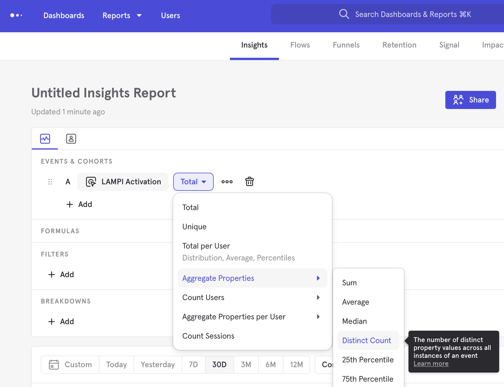
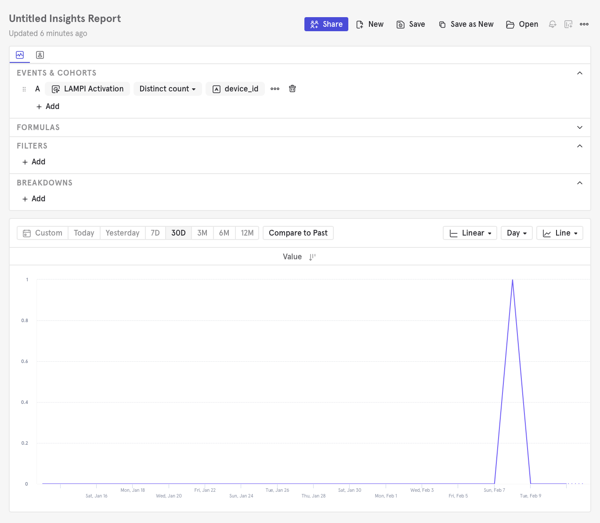

# Logging an Analytics Event

Let's start gathering analytics events. We'll do this from our EC2 instance. There may be events specific to mobile, the Kivy UI, or the webpage we want to capture, but for right now we'll focus on changes to the lamp state.  We will modify the `mqtt-daemon` Django management command to create Mixpanel Events when lamp state changes.

Log into your EC2 instance and install the [Mixpanel python library](https://developer.mixpanel.com/docs/python):

## Installing Mixpanel's Python Library

```bash
cloud$ pip3 install mixpanel
```

## Updating `mqtt-daemon.py` for Mixpanel

Modify **mqtt-daemon.py** To include Keen and monitor lamp state:

```python
import re
from paho.mqtt.client import Client
from django.contrib.auth.models import User
from django.core.management.base import BaseCommand
from django.conf import settings
from lampi.models import *
from mixpanel import Mixpanel


MQTT_BROKER_RE_PATTERN = (r'\$sys\/broker\/connection\/'
                          r'(?P<device_id>[0-9a-f]*)_broker/state')

DEVICE_STATE_RE_PATTERN = r'devices\/(?P<device_id>[0-9a-f]*)\/lamp\/changed'


def device_association_topic(device_id):
    return 'devices/{}/lamp/associated'.format(device_id)


class Command(BaseCommand):
    help = 'Long-running Daemon Process to Integrate MQTT Messages with Django'

    def _create_default_user_if_needed(self):
        # make sure the user account exists that holds all new devices
        try:
            User.objects.get(username=settings.DEFAULT_USER)
        except User.DoesNotExist:
            print("Creating user {} to own new LAMPI devices".format(
                settings.DEFAULT_USER))
            new_user = User()
            new_user.username = settings.DEFAULT_USER
            new_user.password = '123456'
            new_user.is_active = False
            new_user.save()

    def _on_connect(self, client, userdata, flags, rc):
        self.client.message_callback_add('$SYS/broker/connection/+/state',
                                         self._monitor_broker_bridges)
        self.client.subscribe('$SYS/broker/connection/+/state')
        self.client.message_callback_add('devices/+/lamp/changed',
                                         self._monitor_lamp_state)
        self.client.subscribe('devices/+/lamp/changed')

    def _create_mqtt_client_and_loop_forever(self):
        self.client = Client()
        self.client.on_connect = self._on_connect
        self.client.connect('localhost', port=50001)
        self.client.loop_forever()

    def _monitor_for_new_devices(self, client, userdata, message):
        print("RECV: '{}' on '{}'".format(message.payload, message.topic))
        # message payload has to treated as type "bytes" in Python 3
        if message.payload == b'1':
            # broker connected
            results = re.search(MQTT_BROKER_RE_PATTERN, message.topic.lower())
            device_id = results.group('device_id')
            try:
                device = Lampi.objects.get(device_id=device_id)
                print("Found {}".format(device))
            except Lampi.DoesNotExist:
                # this is a new device - create new record for it
                new_device = Lampi(device_id=device_id)
                uname = settings.DEFAULT_USER
                new_device.user = User.objects.get(username=uname)
                new_device.save()
                print("Created {}".format(new_device))
                # send association MQTT message
                new_device.publish_unassociated_msg()
                # record a new activation
                self.mp.track(new_device.user.username, "LAMPI Activation", {'event_type': 'activations', 'interface': 'mqtt', 'device_id': device_id})

    def _monitor_broker_bridges(self, client, userdata, message):
        self._monitor_for_new_devices(client, userdata, message)
        self._monitor_for_connection_events(client, userdata, message)

    def _monitor_for_connection_events(self, client, userdata, message):
        results = re.search(MQTT_BROKER_RE_PATTERN, message.topic.lower())
        device_id = results.group('device_id')
        connection_state = 'unknown'
        if message.payload == b'1':
            print("DEVICE {} CONNECTED".format(device_id))
            connection_state = 'Connected'
        else:
            print("DEVICE {} DISCONNECTED".format(device_id))
            connection_state = 'Disconnected'
        self.mp.track('mqttbridge', "LAMPI {}".format(connection_state), {'event_type': 'devicemonitoring', 'interface': 'mqtt', 'device_id': device_id})

    def _monitor_lamp_state(self, client, userdata, message):
        results = re.search(DEVICE_STATE_RE_PATTERN, message.topic.lower())
        device_id = results.group('device_id')
        event_props = {'event_type': 'devicestate', 'interface': 'mqtt', 'device_id': device_id}
        event_props.update(json.loads(message.payload.decode('utf-8')))

        self.mp.track('mqttbridge', 'LAMPI State Change', event_props)

    def handle(self, *args, **options):
        self.mp = Mixpanel(settings.MIXPANEL_TOKEN)
 
        self._create_default_user_if_needed()
        self._create_mqtt_client_and_loop_forever()
```

An instance of `Mixpanel` is created in the `handle()` method that is used to track and send the various events. 

The `_monitor_for_new_devices()` method has been augmented to record an event named "LAMPI Activation". The [Mixpanel.track()](https://mixpanel.github.io/mixpanel-python/#mixpanel.Mixpanel.track) method has two required properties: 

* **distinct_id** (str) – identifies the user triggering the event
* **event_name** (str) – a name describing the event

An optional **properties** can also be included to track custom values for this event.

For this event we are storing values for `event_type`, `interface` and `device_id`. These will be used for grouping and visualization in a following section.
```python
self.mp.track(new_device.user.username, "LAMPI Activation", {'event_type': 'activations', 'interface': 'mqtt', 'device_id': device_id})
```

We have also added a new MQTT Subscription ("devices/+/lamp/changed") and handler to listen for all device lamp state changes:

```python
    def _monitor_lamp_state(self, client, userdata, message):
        results = re.search(DEVICE_STATE_RE_PATTERN, message.topic.lower())
        device_id = results.group('device_id')
        event_props = {'event_type': 'devicestate', 'interface': 'mqtt', 'device_id': device_id}
        event_props.update(json.loads(message.payload.decode('utf-8')))

        self.mp.track('mqttbridge', 'LAMPI State Change', event_props)
```

We extract the device ID from the topic with the regex, and create and Event record with the device ID and device state (e.g., hue, saturation, brightness, on/off).  Note: Python3 distinguishes between String (`str`) and Byte arrays (`bytes`) - `json.loads()` requires the input to be a string, but the MQTT payload is a  byte array - we can decode that byte array to a UTF-8 string with the `.decode('utf-8')`.  See [Python Unicode HOWTO](https://docs.python.org/3/howto/unicode.html) for more information.

To get your **Project Token**, navigate back to [Mixpanel.com](https://mixpanel.com), open the settings under the gear icon and select your project name. On this page scroll down until you get to **Access Keys**.



In order to isolate our Mixpanel settings and avoid future git merge conflicts, create a file **mixpanel_settings.py** in the same directory as [settings.py](../../Web/lampisite/lampisite/settings.py). Copy the **Project Token** from the web page into the newly created file at [mixpanel_settings.py](../../Web/lampisite/lampisite/mixpanel_settings.py). Your [mixpanel_settings.py](../../Web/lampisite/lampisite/mixpanel_settings.py) file should look like this:

```python
MIXPANEL_TOKEN = "YOUR_MIXPANEL_TOKEN"
```

> **NOTE:** [mixpanel_settings.py](../../Web/lampisite/lampisite/mixpanel_settings.py) has been added to the **.gitignore** to avoid future conflicts. [settings.py](../../Web/lampisite/lampisite/settings.py) has also been updated to import from [mixpanel_settings.py](../../Web/lampisite/lampisite/mixpanel_settings.py).

You can stop `mqtt-daemon` in supervisor:

```bash
$cloud sudo supervisorctl stop mqtt-daemon
```

and run it manually while you're developing it:

```bash
$cloud cd ~/connected-devices/Web/lampisite
$cloud ./manage.py mqtt-daemon
```

Once it's running, press the power button on the LAMPI touchscreen a couple times. 

Navigate back to [Mixpanel.com](https://mixpanel.com), open the **Data Management** menu and select **Live View**. 



You should see the associated `LAMPI Disconnected`, `LAMPI Connected` and `LAMPI State Change` events. Clicking on an event will expand its properties. Events may take a couple minutes to appear. Try turning LAMPI off and ensure the the on value is `false`.



To see the activations event, halt mosquitto on your pi:

```bash
$lamp sudo service mosquitto stop
```

Use the Django Admin to delete any LAMPI devices in the database.

Make sure the `mqtt-daemon` is running.  Then, start mosquitto back up on the pi

```bash
$lamp sudo service mosquitto start
```

You should be able to use **Live View** to see your "LAMPI Activation" event.

## Mixpanel Reports

Mixpanel comes with a number of builtin **Reports** that can be used to analyze and visualize your events. The free account is limited in which reports you can run, but they'll suit our needs for this chapter. Let's create an **Insights** report for the number of unique LAMPI devices that have activated in the last 30 days.

* Select **Insights** under the **Reports** menu at the top
* Choose "LAMPI Activation" as the event we want to report on
* Instead of total events, chart the unique **device_id**'s
	* Select **Aggregate Properties** > **Distinct Count**
     
	* Choose **device_id**
* Select **30D** above the graph below

The report should automatically update as you make changes. Your final report will look something like this:



Next up: [10.3 Web Analytics](../10.3_Web_Analytics/README.md)

&copy; 2015-2021 LeanDog, Inc. and Nick Barendt
