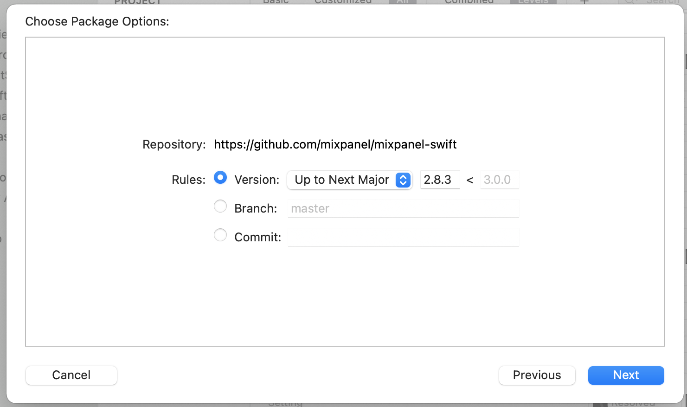

# iOS Analytics 

Mixpanel has a [mixpanel-swift](https://github.com/mixpanel/mixpanel-swift) library to support analytics event recording on iOS.

## Installing [mixpanel-swift](https://github.com/mixpanel/mixpanel-swift)

Several different ways are provided to [Install](https://github.com/mixpanel/mixpanel-swift#installation) mixpanel-swift - we will use the [Swift Package Manager](https://github.com/mixpanel/mixpanel-swift#swift-package-manager) solution.

1. In Xcode, select File > Swift Packages > Add Package Dependency.
2. Enter `https://github.com/mixpanel/mixpanel-swift` into the text field labeled **Enter package repository URL** and hit **Next**
3. Confirm the library will not update above the next major version and hit **Next**. *(This should be the default)*
    
4. Confirm the library will be included in the **Lampi** target. *(This also should be the default)*
    

At the time of this writing, the [Initializing and Usage](https://github.com/mixpanel/mixpanel-swift#initializing-and-usage) section of Mixpanel's Readme does not include instructions on how to integrate with SwiftUI. So you'll have to follow these instructions:

1. Import Mixpanel into **LampiApp.swift**
2. Initialize Mixpanel with your unique token when the App is initialized.
3. Register the **interface** super property as **iOS**

Your **LampiApp.swift** file should now look like this:

    ```swift
    import SwiftUI
    import Mixpanel
    @main
    struct LampiApp: App {
        #warning("Update DEVICE_NAME")
        let DEVICE_NAME = "LAMPI XXXXXXX"
    
        #warning("Update MIXPANEL_TOKEN")
        let MIXPANEL_TOKEN = "MIXPANEL_TOKEN"
    
        init() {
            Mixpanel.initialize(token: MIXPANEL_TOKEN)
            Mixpanel.mainInstance().registerSuperProperties(["interface": "iOS"])
        }
    
        var body: some Scene {
            WindowGroup {
                LampiView(lamp: Lampi(name: DEVICE_NAME))
            }
        }
    }
    ```

> **NOTE:** If you've pulled the Chapter 9 solution, you'll notice that there is additional code in the project for searching for and connecting to near by Lampis. This browsing code is optional and is not in the above sample.

## Tracking UI Events

Much like the Javascript library, tracking an event requires an event name and an optional dictionary that contains custom properties. To help us track events with the `event_type` of `ui` we'll create a small helper extension of `MixpanelInterface` in **LampiApp.swift**. After the `LampiApp` struct, add the following code:

```swift
extension MixpanelInstance {
    func trackUIEvent(_ event: String?, properties: Properties = [:]) {
        var eventProperties = properties
        eventProperties["event_type"] = "ui"

        track(event: event, properties: eventProperties)
    }
}
```

The above code is a small helper to ensure that any UI event tracked will include `event_type` of `ui`. We now have event_types of `ui`, `page_view`, `activations`, `devicemonitoring` and `devicestate`. We'll use `event_type` segment and visualize the different events in an upcoming section.

Let's use the above helper to track changes in the Hue slider in **LampiView.swift**. First add `import Mixpanel` to the top of **LampiView.swift** so we can make use of the recently imported Mixpanel library.

The current code for the Hue slider looks something like this:

```swift
GradientSlider(value: $lamp.state.hue,
               handleColor: lamp.state.baseHueColor,
               trackColors: Color.rainbow())
```

Since we bound the slider to `$lamp.state.hue`, any time the slider changed the value was updated and we did not need to write any specific change handler. For our tracking purposes though, we'll want to track a UI event only when a slider is changed by the user. Thankfully **GradientSlider** has an `onEditingChanged` closure that can be set and called only when the user directly interacts with the slider and provides the currently value. To leverage this function we add what is called a [Trailing Closure](https://docs.swift.org/swift-book/LanguageGuide/Closures.html#ID102). The tracking code for the Hue slider should look something like this:

```swift
GradientSlider(value: $lamp.state.hue,
               handleColor: lamp.state.baseHueColor,
               trackColors: Color.rainbow()) { hueValue in

    Mixpanel.mainInstance().trackUIEvent("Slider Change",
                                         properties: ["slider": sliderName, "value": hueValue])
}
```

You will follow this basic pattern to track events for the other sliders.

## Uploading Events

To avoid too many network calls and slowing down the app, [mixpanel-swift](https://github.com/mixpanel/mixpanel-swift) will automatically queue up analytic event records on the device and send them to the cloud based on time and events. This behavior is different when you compare it to the web event tracking where things were more immediate. If you'd like to trigger Mixpanel to push its queue to the cloud just put the Lampi app in the background by switching apps or going to your home screen. This should trigger a push of any queued events.

Next up: [10.5 Mixpanel Dashboard](../10.5_Mixpanel_Dashboard/README.md)

&copy; 2015-2021 LeanDog, Inc. and Nick Barendt
