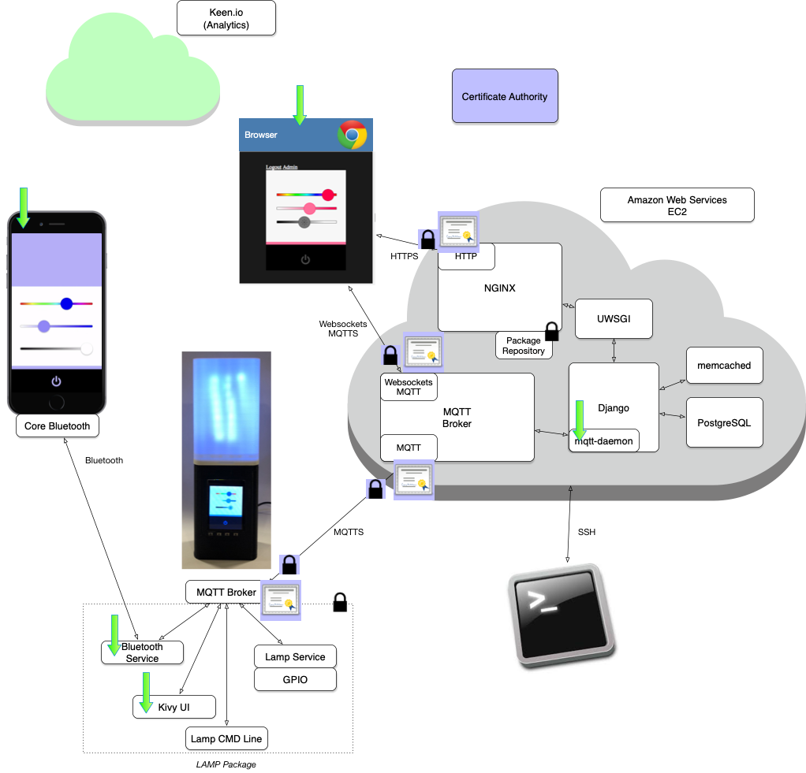
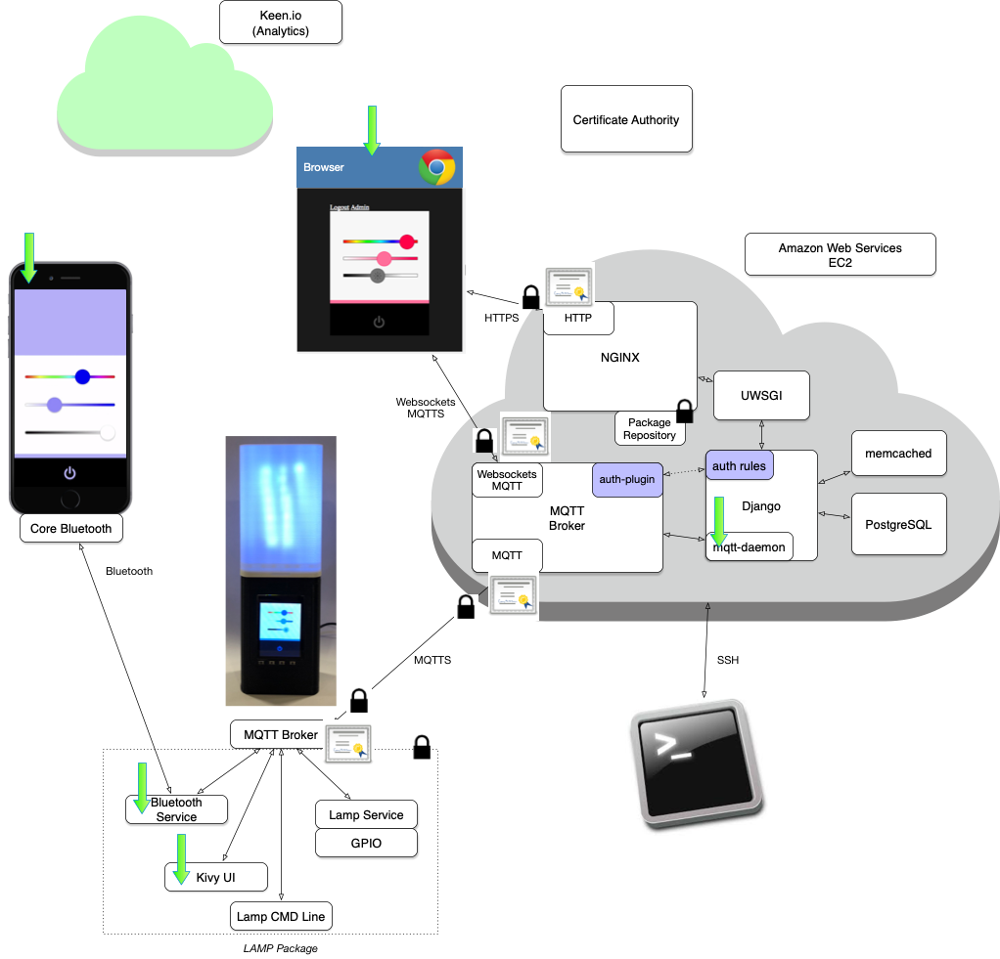

# Authentication and Authorization with Mosquitto and Django

In the previous assignment we added _some_ security to the system with SSL/TLS.  That allows us to securely encrypt all web, websockets, and MQTT communications.  It also allows clients to authenticate the servers are who they say they are, and MQTT Broker in EC2 to authenticate LAMPI devices.

To date, we have built a system that looks like this:



There are still some significant security gaps in our model, though, including:

* no limits to which devices users can communicate with at the MQTT level (MQTT or WebSockets MQTT)
* no limitations on Lampi devices specifying how and which topics are mapped into the global MQTT topic namespace on EC2 - a compromised device could potentially wreak havoc on the entire system, by injecting requests or snooping on other device/user interactions
* no authentication of users connecting to the MQTT websockets interface

This chapter will begin to address these issues.

We will be integrating Mosquitto with Django for authentication and authorization, including access control with MQTT.  Django will serve as our Single Point of Truth (SPOT) for authentication and ACL checks.


## Mosquitto's Authentication Plugin Architecture

Mosquitto supports an extensible plugin architecture, for both user authentication and Access Control Lists (ACL).  You are familiar with user authentication - typical username/password.  

ACLs allow for very fine-grained permission models.  When applied to Pub/Sub systems, they allow the control of which users/devices/services can publish to particular topics and which users can subscribe to particular topics.  Because the rules can be complex they can implement very sophisticated behaviors - for example:

* _User XYZ can Publish to topic 123/456_
* _User XYZ can Publish to topic 123/456 if the current time is between 8:00AM and 5:00PM Eastern_
* _User XYZ can Publish to topic 123/456 if the current time is between 8:00AM and 5:00PM Eastern, but only if no messages have been published in the last 15 minutes_.

## Mosquitto's Auth Plugin Architecture 

The MQTT Mosquitto broker supports several different authentication and authorization mechanisms.  The most flexible uses an external "plugin" architecture.  This is implemented with a shared library (.so), a compiled (binary) executable, typically written in C or C++.

The filesystem path to the ".so" is specified in the Mosquitto configuration file, possibly with optional parameters for the plugin.  After making these configuration changes and restarting Mosquitto, the auth-plugin is responsible for handling all authentication and ACL checks.

There are several auth-plugin projects available, including:

* [mosquitto-auth-plug](https://github.com/jpmens/mosquitto-auth-plug)
* [mosquitto_pyauth](https://github.com/mbachry/mosquitto_pyauth)

We will be using **mosquitto-auth-plug** with an HTTP backend (**mosquitto-auth-plug** supports a variety of "backends" including HTTP, PostgreSQL, Redis, LDAP, and many others).

With the plugin configured for HTTP, whenever Mosquitto needs to decide on an authentication or ACL query, it will make an HTTP request prior to the Publish (Write) or message delivery (Read).  

The hostname, port, and URLs it uses for the HTTP backend is configurable.  

The HTTP then responds to the request with an HTTP response, including a status code:

* 200 (OK), approving the request (e.g., to allow username XYZ to connect with password ABC)
* 403 (Forbidden) (e.g., to deny a requested message write - publish)

The slightly modified architecture diagram looks like:



This allows you to make a more dynamic and sophisticated authentication and ACL system than just password and ACL files on disk (a built-in features in Mosquitto), and in our case, allows us to centralize both functions in Django, our HTTP framework.


# **mosquitto-auth-plug** and Ansible

The plugin is distributed in source code, and requires a copy of the Mosquitto Broker source code with the same version as the installed Mosquitto in order to build the **auth-plug.so**.

To simplify and reduce the potential for errors in building and installing the plugin, the Ansible playbooks for this chapter will install and configure the plugin on your EC2 instance.

**NOTE:** **IMPORTANT!!!!!!** 

once you install the **mosquitto-auth-plug** with Ansible, your EC2 Mosquitto Broker will start to deny *ALL* operations until you start to create and run a backend HTTP service (coming up).

# Configuration **mosquitto-auth-plug**

For this section, we will assume that you have the **auth-plug.so** installed.  Ansible will install it in ```/etc/mosquitto/plugins/```.

Ansible will also install a new Mosquitto configuration snippet in ```/etc/mosquitto/conf.d/``` with the following contents:

```
allow_anonymous false

auth_plugin /etc/mosquitto/plugins/auth-plug.so
auth_opt_backends http
auth_opt_http_ip 127.0.0.1
auth_opt_http_port 8080
auth_opt_http_getuser_uri /lampi/auth
auth_opt_http_superuser_uri /lampi/superuser
auth_opt_http_aclcheck_uri /lampi/acl
```

This will tell Mosquitto to route all auth requests to **localhost** on port **8080** at the following endpoints:

 * http://127.0.0.1:8080/lampi/auth
 * http://127.0.0.1:8080/lampi/superuser
 * http://127.0.0.1:8080/lampi/acl

**NOTE: if no HTTP service is running at http://127.0.0.1:8080, ALL authentication and access control checks will FAIL**.

Please refer to the [HTTP Backend Configuration](https://github.com/jpmens/mosquitto-auth-plug#http) for more information.

**NOTE:** this allow disallows "anonymous" connections - all connections must be authenticated with username/password (or clients must use a SSL/TLS certificate).

# Debugging the Mosquitto Auth Plugin

## ```tmux```

We highly suggest that you install [tmux](https://tmux.github.io/) on both Lampi and your EC2 cloud instance (in fact, Ansible will install it for you). This will allow you to split the terminal screen into panes, each of which can have a Bash shell. This will allow you to run Mosquitto from the commandline, the Django app, and pub/sub with Mosquitto to test out the Cloud connection. Using tmux on Lampi will also be useful in this way. To install tmux, execute `sudo apt-get install tmux` on both `cloud$` and `lamp$` Here is a [tmux cheat sheet](http://tmuxcheatsheet.com/).

## Debugging Mosquitto 

For debuging purposes, it is often convenient to run mosquitto in a shell with verbose output, instead of in daemon mode:

```bash
cloud$ sudo service mosquitto stop
cloud$ sudo mosquitto -c /etc/mosquitto/mosquitto.conf -v
```

**NOTE:** it seems that the `sudo service mosquitto stop` does not always stop mosquitto completely; if you get an error when you run `sudo mosquitto...` you can try `sudo killall mosquitto`.

**NOTE:** you might need to configure **stdout** as a log destination in **/etc/mosquitto/mosquitto.conf** by appending `log_dest stdout` to the end of the file

This works on both the Pi and on EC2 and can be critical in debugging authenticiation and ACL issues.

Running mosquitto from the commandline in this way will cause it to dump *very* verbose logging information to the shell.  With the mosquitto_auth_plug, each transaction results in multiple log lines, with each call out to the HTTP server, with the url and query string parameters, and results returned (HTTP status code, etc.)

## Mosquitto Auth-Plugin Behavior


To summarize the _Auth_ and _ACL_ behavior is:

* all MQTT clients connecting are Authenticated
* all MQTT messages being published are ACL checked with username, topic, clientid, and Write access
* all MQTT messages being passed on to a subscribing client are ACL checked with the same (username, topic, clientid) but for Read access

**Every** message is ACL checked on writing it to the broker and on delivery to **every** subscribing client. For efficiency, the custom Auth plugin caches results from the HTTP server for a period of time.

Clients are **authenticated** when connecting, and **every** message is ACL checked on publishing, and **every** delivery of a message is ACL checked prior to delivery to **every** subscribing client.

Each Auth or ACL check results in an HTTP POST.  The HTTP Request includes parameters, depending on the operation.  From the plugin documentation:

| URI-Param         | username | password | clientid | topic | acc |
| ----------------- | -------- | -------- | -------- | :---: | :-: |
| http_getuser_uri  |   Y      |   Y      |   N      |   N   |  N  |
| http_superuser_uri|   Y      |   N      |   N      |   N   |  N  |
| http_aclcheck_uri |   Y      |   N      |   Y      |   Y   |  Y  |

Next up: [14.2 Testing a Simple Django Auth Backend](../14.2_Testing_a_Simple_Django_Auth_Backend/README.md)

&copy; 2015-2021 LeanDog, Inc. and Nick Barendt
